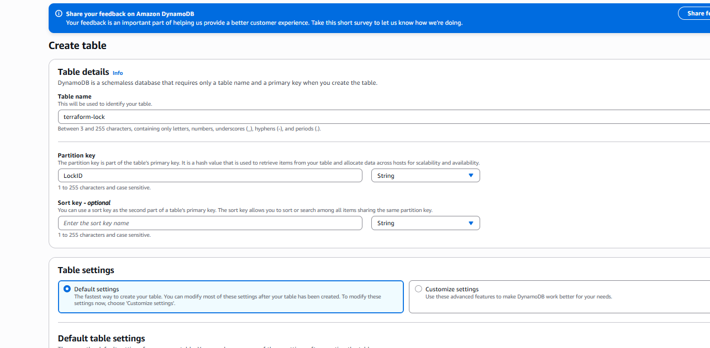

# manual steps


## create S3 bucket, basic default settings will work
```
bucket name: my-tf-bucket-1726"
```

## folder structure
```
terraform/create_vm
 ├── main.tf
 ├── variables.tf
 ├── backend.tf   ← S3 config
```

## udpate terraform/backend.tf. Update bucket name as per actual
```
terraform {
  backend "s3" {
    bucket         = "my-tf-bucket-1726"
    key            = "ec2/terraform.tfstate"
    region         = "ap-south-1"
    dynamodb_table = "terraform-lock"
  }
}
```

## create dynamo db
| Setting           | Value                            |
| ----------------- | -------------------------------- |
| **Table name**    | `terraform-lock`                 |
| **Partition key** | `LockID`                         |
| **Key type**      | String                           |
| **Region**        | Same as S3 bucket (`ap-south-1`) |


